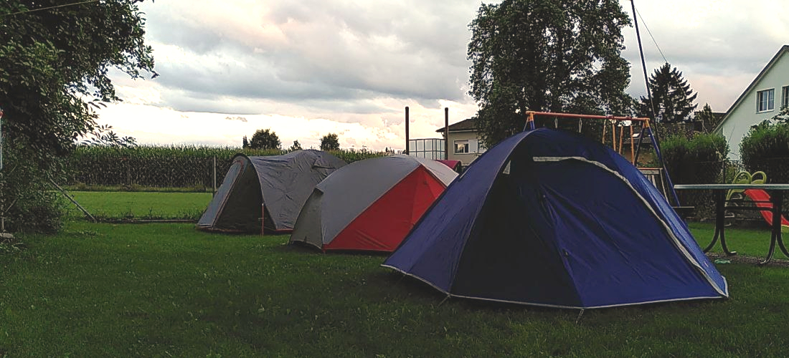
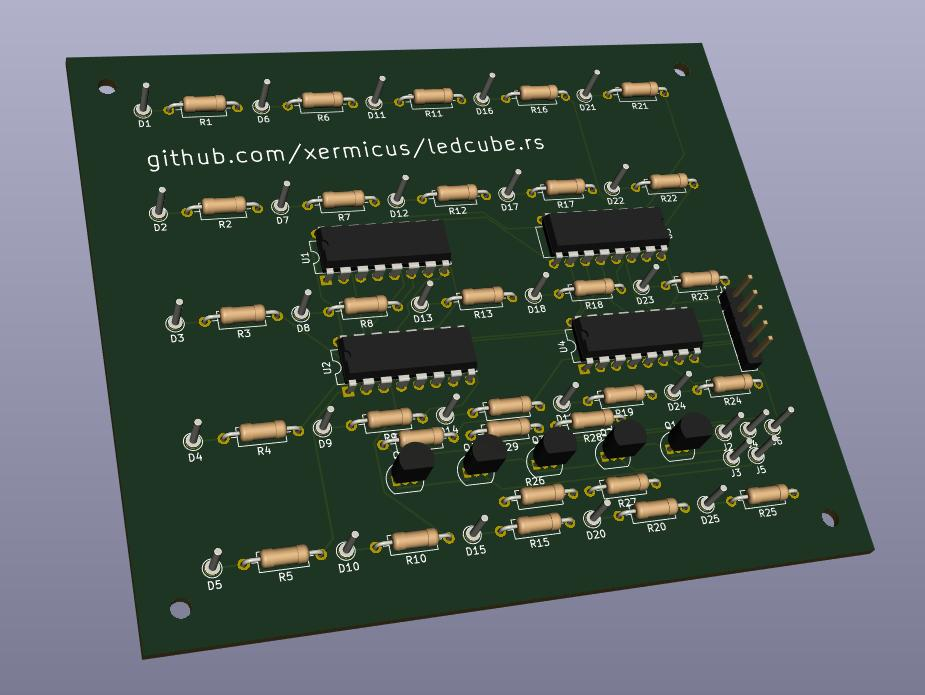

Mit dem LuxCamp hat vom 05. bis 08. August 2021 unser 1. mehrtägiger Event in Brüttisellen stattgefunden. Dem nassen und kaltem Wetter (Sommer!?) haben wir mit ausgelassener Stimmung, produktiver Baschtel-Atmosphäre sowie feinen Grilladen getrotzt. Zwischen Säuli, Zelt und Kindern wurde viel Elan dem nachfolgenden kleinem Assortiment an Baschteleien gewidmet (dies ist natürlich keine abschliessende Liste).

## Display
Das runde "Display" von Pnt war ohne Frage Publikumsmagnet #1. Zwischenzeitlich gingen die obersten beiden LED Streifen defekt. Mit vereinter Kraft haben wir es wieder zum leuchten gebracht:

Details zu unserem Display finden sich in diesem [Blogpost](https://zurich.fablab.ch/2020/12/led-display-mit-neopixel-und-laser-cutter-bauen/).

## ledcube schema
Seit einiger Zeit beschäftige ich mich mit dem Bau von [LED Cubes](https://github.com/xermicus/ledcube.rs). Damit der Bau eines solchen Stückes etwas einfacher wird, habe ich mich mit [KiCad](https://www.kicad.org/) daran gewangt ein Schema zu zeichnen. Dank einem super [Tutorial](https://www.build-electronic-circuits.com/kicad-tutorial/) sowie "Oli-Consulting" bin ich sogar damit fertig geworden und das PCB ist bereits zu mir unterwegs.

Das Resultat im 3D Viewer:

## Olis LED Lampe
Das PCB für die Lampe ist custom-made. Die LEDs sind Kreisförmig angeordnet. Interessantes Konzept und sieht super aus!

## Siebdruck
More Swag! Vielen Dank an Pnt und Ava für die sehr coolen Siebdrucke. Falls du die Gelegenheit verpasst hast, versuche es evtl. beim nächsten grösseren LuXeria Event ;-)

## Teleskop
Gandro hat sein Teleskop mitgebracht. Als weltraumbegeisterte Person hat mich dies natürlich sehr fasziniert. Leider war die Sicht nicht ganz so gut. Trotzdem konnten wir interessante Objekte wie z.B. Jupiter und einige seiner Monde sowie Saturn mit seinem Gürtel beobachten. Nachfolgende Animation wurde mit dem Teleskop selbst gemacht:

Ausserdem haben wir auch an einem zweiten Teleskop mit einer Steuerung für vollautomatisches Vollmond-Tracking gebastelt:

## [konzept.wtf](https://konzept.wtf)
Ein simpler Blog, gebaut mit [Zola](https://github.com/getzola/zola), eine moderne "static site engine" geschrieben in Rust. Meine Takeaways:
* Zola selbst funktioniert ziemlich einfach und ziemlich schnell. Die initiale Version der Website ist auf meinem Laptop in 30ms generiert. Automatisches refresh bei einer Änderung einer Datei der Website funktioniert ebenfalls tadellos und ist ein wahrer Segen.
* Die meisten Design Themen, welche ich ausprobierte, haben leider nicht so gut funktioniert. Zumindest nicht mit dem aktuell Release der Software. Das störte mich und erforderte einiges an Debugging, da ich noch selbst von vorne ein Design erstellen wollte.
* [Netlify](https://netlify.com) unterstützt Zola. Dies bedeutet, dass der Blog gratis auf Netlify gehostet werden kann. Zudem ist dies [sehr schnell und einfach eingerichtet](https://www.getzola.org/documentation/deployment/netlify/). Nett!

## Diskussion, SuperTuxKart und so weiter
Selbstverständlich ist der gesellschaftliche Aspekt nicht zu kurz gekommen. Sei es mit ausgiebigen Diskussion über Technik, Gott und die Welt. Oder mit einer Runde SuperTuxKart - echt nette Auflockerung für Zwischendurch! Der an MarioKart angelehnte Racer kann im LAN Modus mit bis zu 8 Spielern gezockt werden und ist einfach zu spielen. Eignet sich deshalb herrovragend als digitales Gesellschaftsspiel. Zudem ist es in den Paketquellen vieler Distros enthalten, ansonsten: [https://supertuxkart.net/Main_Page](https://supertuxkart.net/Main_Page)

## Danke!
Mir bleibt nur noch ein herzlichen Dankeschön auszusprechen: An Maldex für das Hosting an wunderschöner Lage sowie allen Teilnehmern und spontanen Besuchern, die auf irgend eine Weise einen Beitrag dazu geleistet haben. Danke!
