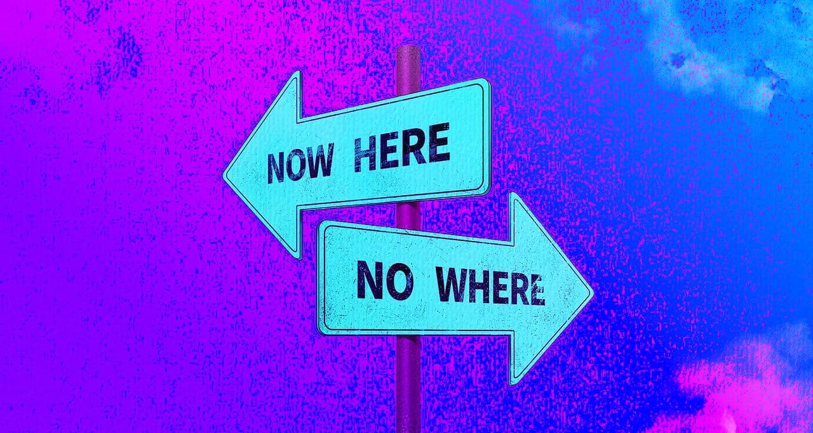

Für uns findet der rc3 "Now Here" statt. Wir geniessen den Jahresabschluss zusammen mit dem Labor Luzern und mit lokalen Vorträgen und Workshops.

Vom 27.12.21 bis 30.12.21 findet ein gemeinsamer öffentlicher Anlass im Labor Luzern [Hackspace](https://laborluzern.ch/) statt. Egal ob du den lokalen Vorträgen und Workshops lauschen, dich in den offiziellen Tracks einklinken oder einfach ein paar lehrreiche und gemütliche Stunden verbringen möchtest, du bist herzlich willkommen.

Das lokale Programm wird Mitte Dezember an dieser Stelle veröffentlicht.

Wir freuen uns auf spannende Workshops, Vorträge und gemütliche Stunden.

__Für den Event gilt Zertifikats- und Maskenpflicht.__  
Das Organisationsteam behält sich vor, die Coronamassnahmen kurzfristig noch den aktuellen Gegebenheiten und Regelungen anzupassen. Die definitive Regelung werden wir 2-3 Tage vor dem Event veröffentlichen.

## Call for participation

Wir sind noch auf der Suche nach lokalen Vorträgen und Workshops. Falls du noch ein spannender Workshop oder Vortrag durchführen kannst, melde dich bei Gandro oder Guac über die üblichen Kanäle.
