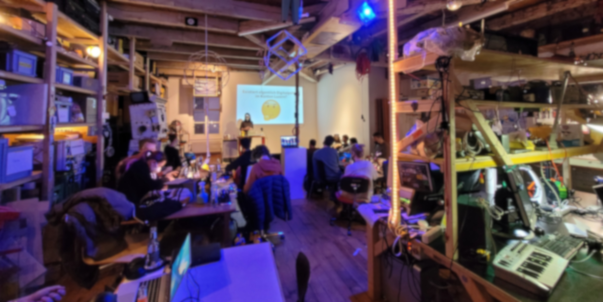

Auch dieses Jahr zieht das Chaos in den Hackspace des LABOR Luzerns.
Organisiert vom LABOR Luzern und der LuXeria veranstalten
wir wieder ein Congress-Ersatzprogramm um gemeinsam das Jahr
ausklingen zu lassen.   Das Wichtigste in Kürze:

 - 🗓️ *Datum:* 28.-30. Dezember 2022
 - 🏢 *Ort:* [Das LABOR, Degenstrasse 3, 6010 Kriens](https://goo.gl/maps/HrSMu33hREPF8U8XA)
 - 📢 *Mitmachen:* [Call for Proposals](https://laborluxeria.github.io/winterchaos2022/cfp) (14.-30. November 2022)
 - 🔗 *Infos:* [laborluxeria.github.io/winterchaos2022](https://laborluxeria.github.io/winterchaos2022/)

Bild: *Impressionen vom letzten Jahr (Kriens, 30.12.21)*

Der Event lebt von spannenden Vorträgen und Workshops. Deswegen starten wir heute
einen *Call for Proposals*, welcher noch bis zum 4. Dezember 2022 dauert:

> Wir möchten wieder ein unkompliziertes Treffen von Hacker:innen, Technikfreaks,
> Bastler:innen, Utopisten oder einfach Interessierten organisieren.
> Vom 28.12.2022 - 30.12.2022 möchten wir einen offenen Raum schaffen um sich
> auszutauschen, sich zuzuhören, voneinander zu lernen und miteinander zu feiern.
> Der Schwerpunkt liegt bei Themen rund um die Informationstechnologie, Netzwerke,
> IT-Security, der Maker-Szene und dem kritisch-gestalterischen Umgang mit
> Technologie und deren Auswirkung auf die Gesellschaft.
>
> Wir freuen uns über Vorträge, Kurzvorträge und Workshops.
> Deinen Beitrag kannst du [**auf Papercall**](https://www.papercall.io/winterchaos)
> online einreichen oder per Mail an michi[at]laborluzernPUNKTch.

Weitere Informationen findest du auf der Webseite der Veranstaltung:
[laborluxeria.github.io/winterchaos2022](https://laborluxeria.github.io/winterchaos2022/).

Das Programm vom letzten Jahr findest du [hier](https://laborluzern.ch/event/rc3/).
